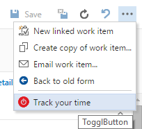
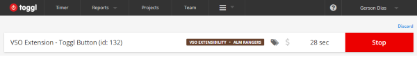
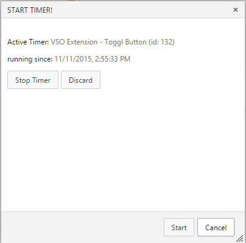

#Track your time - Toggl Button Extension for VSTS

Do you have a good way to track the time you spend in an activity? How to summarize the information about how much time you spend in a project and do some great reports to give to your clients or managers?
[toggl.com](http://toggl.com) is the best way to track your time and focus on what is important. Integrate [toggl.com](http://toggl.com) with Visual Studio Team Services work items and improve your productivity.

## Quick steps to get started 
1. Signup at [toggl.com](http://toggl.com) website;
1. Configure your projects and clients in toggl.com website;
1. Go to [My Profile](https://toggl.com/app/profile) and copy your API token (at bottom of My Profile page);
1. Choose a work item to start your work and click in "Track your Time";  
  

1. Paste Toggl API Key in the corresponding field and click in "Refresh" (if you will, you need to do this only once per user/browser);
1. Choose a Client/Project and tags for your activity;
1. Click in "Start" and begin your work;  
  

1. You can see the running timer at [toggl.com](http://toggl.com/app) or clicking again in "Track your Time" in any WorkItem  
  
  
  

## Learn more about this extension
* Fork it on [GitHub Repository](http://github.com/gersondias/toggl-buttonVSOExtension)
* Let's discuss [Issues and Improvements](http://github.com/gersondias/toggl-buttonVSOExtension/issues)
* To learn more about developing an extension for Visual Studio Team Services, see the [overview of extensions](https://www.visualstudio.com/en-us/integrate/extensions/overview)
* Notice for certain third party software included in this extension are provided here: [Third Party Notice.](https://marketplace.visualstudio.com/_apis/public/gallery/publisher/GersonDias/extension/TogglButton/latest/assetbyname/ThirdPartyNotice.txt)
								  
